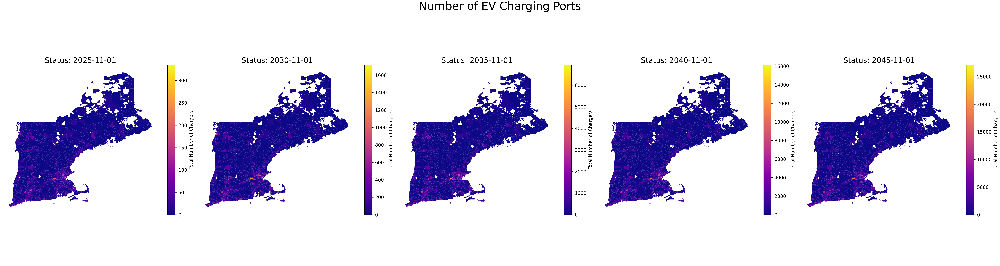
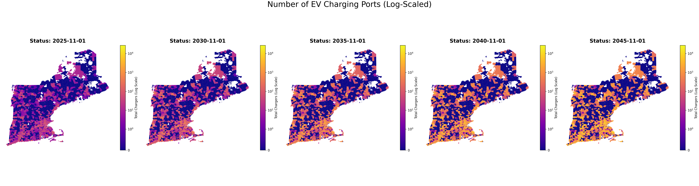

## Full write-up
- [Technical write-up (PDF)](reports/Technical-Write-Up.pdf)
- [Project purpose (PDF)](reports/Project-Purpose.pdf)

## Method overview
- Trained models (Linear Regression, Decision Tree, Random Forest, Neural Net); selected Random Forest with log relation to handle skew / “charging deserts”.
- Allocated ISO-NE regional EV load forecasts to ZIP codes using proportional mapping.
- Converted ZIP-level load to charging-port requirements and an installation schedule, assuming annual charging-tech improvement and neighbor spillover.

## Results (visuals)
-Charging Ports Heatmap

-Increase in Charging Ports by Zipcode Over Time

